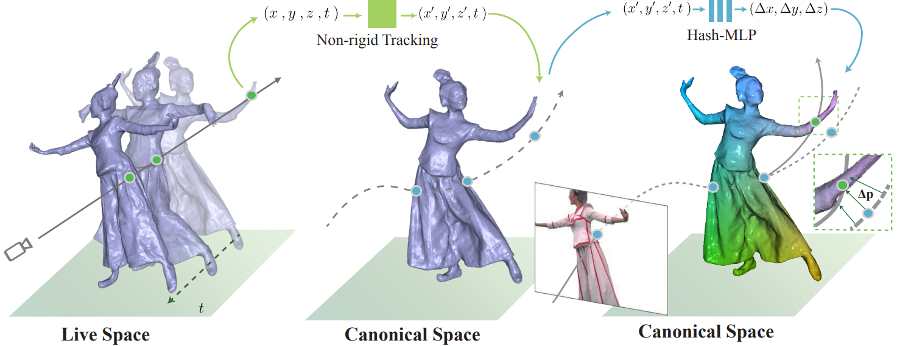
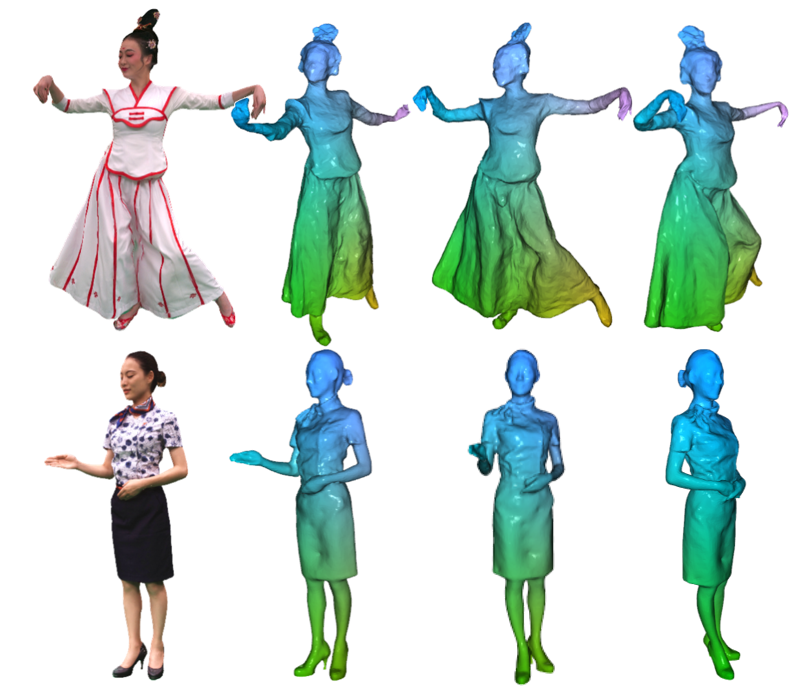

# Instant-NK(Instant Neural tracKer, Pytorch)


A pytorch implementation of instant-NK based on [torch-ngp](https://github.com/ashawkey/torch-ngp) as described in Human Performance Modeling and Rendering via Neural Animated Mesh.


 
We propose a hybrid neural tracker to generate animated meshes, which combines explicit non-rigid tracking with implicit
dynamic deformation in a self-supervised framework. The former provides
the coarse warping back into the canonical space, while the latter implicit
one further predicts the displacements using the 4D hash encoding as in our
reconstructor.


# Install

First, you need to set training 
```bash
pip install -r requirements.txt
```
Tested on Ubuntu with torch 1.10.1 & CUDA 11.1 on RTX 3090.

# Usage

We use the same data format as nerf and instant-ngp. 
To perpare the mesh for subsequent non-rigid tracking, you should run the [instant-nsr](https://github.com/zhaofuq/Instant-NSR/) or other reconstruction algorithms.

For non-rigid tracking, you can perform [DynamicFusion](https://github.com/dolphin-li/DynamicFusion) or other non-rigid registration methods to acquire the ED nodes and motions.


First time running will take some time to compile the CUDA extensions.


Train your own models, you can run following shell:
```bash
# Instant-NSR Training
OMP_NUM_THREADS=8 CUDA_VISIBLE_DEVICES=${CUDA_DEVICE} python train_nerf.py "${INPUTS}/spider" --ed_folder "${INPUTS}/ed_folder"  --workspace "${WORKSAPCE}"    --st_frame 0 --num_image 76 --num_frames 10 --dyna_mode deform
```

Then, you can extract surface from the trained network model by: 
```bash
# 
OMP_NUM_THREADS=8 CUDA_VISIBLE_DEVICES=${CUDA_DEVICE} python train_nerf.py "${INPUTS}/spider" --ed_folder "${INPUTS}/ed_folder"  --workspace "${WORKSAPCE}"    --st_frame 0 --num_image 76 --num_frames 10 --dyna_mode deform --test

```

# Results
Here are some reconstruction results from our Instant-NSR code:
 

# Acknowledgement

Our code is implemented on torch-ngp code base:
```
@misc{torch-ngp,
    Author = {Jiaxiang Tang},
    Year = {2022},
    Note = {https://github.com/ashawkey/torch-ngp},
    Title = {Torch-ngp: a PyTorch implementation of instant-ngp}
}
```erf_pl/},
        year = {2020},
    }
    ```
* The NeRF GUI is developed with [DearPyGui](https://github.com/hoffstadt/DearPyGui).
